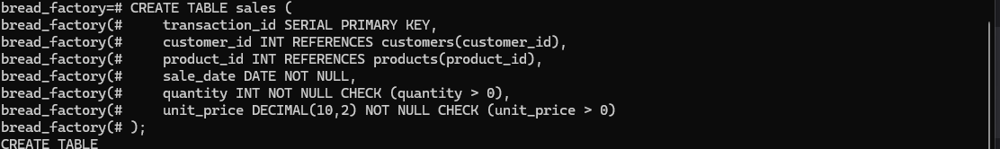

# Bread Factory Analytics - Gasabo District, Kigali

## Overview
This project implements a comprehensive analytics system for a Bread factory in Gasabo District, Kigali. Using PostgreSQL window functions, it analyzes sales patterns, customer behavior, and production metrics to derive actionable insights for business optimization.

## Database Design
### Schema
The database consists of three primary tables:
- **Customers**: Records customer information including name and region (Gasabo, Nyarugenge, Kicukiro)
- **Products**: Stores bread product details including name and category
- **Sales**: Tracks all transactions linking customers and products with date, quantity, and pricing information

#### Entity Relationship Diagram


### Table Structures and Sample Data

#### Customers Table
Table Structure:


Sample Data:


#### Products Table
Table Structure:


Sample Data:


#### Sales Table
Table Structure:


Sample Data:


### SQL Table Definitions
```sql
-- Customers
CREATE TABLE customers (
    customer_id SERIAL PRIMARY KEY,
    name VARCHAR(100) NOT NULL,
    region VARCHAR(50) NOT NULL CHECK (region IN ('Gasabo', 'Nyarugenge', 'Kicukiro'))
);

-- Products
CREATE TABLE products (
    product_id SERIAL PRIMARY KEY,
    name VARCHAR(100) NOT NULL,
    category VARCHAR(50) NOT NULL
);

-- Sales
CREATE TABLE sales (
    transaction_id SERIAL PRIMARY KEY,
    customer_id INT REFERENCES customers(customer_id),
    product_id INT REFERENCES products(product_id),
    sale_date DATE NOT NULL,
    quantity INT NOT NULL CHECK (quantity > 0),
    unit_price DECIMAL(10,2) NOT NULL CHECK (unit_price > 0)
);
```

## Analytics Implementation

The analysis employs five types of advanced window function queries:

1. **Product Rankings by Region**
   - Identifies top 5 products per region per quarter
   - Uses RANK() window function with region and quarter partitioning
   ```sql
   RANK() OVER (PARTITION BY region, quarter ORDER BY total_revenue DESC)
   ```
   

2. **Running Revenue Totals**
   - Calculates running monthly total revenue by product category
   - Implements SUM() with ROWS frame for cumulative totals
   ```sql
   SUM(monthly_revenue) OVER (
       PARTITION BY category
       ORDER BY sale_month
       ROWS UNBOUNDED PRECEDING
   )
   ```
   

3. **Growth Analysis**
   - Computes month-over-month revenue growth percentage
   - Utilizes LAG() function for previous month comparison
   ```sql
   LAG(total_revenue) OVER (ORDER BY sale_month)
   ```
   

4. **Customer Segmentation**
   - Segments customers into spending quartiles
   - Employs NTILE(4) for customer spending distribution
   ```sql
   NTILE(4) OVER (ORDER BY total_spend DESC)
   ```
   

5. **Production Trends**
   - Analyzes 3-month moving average of daily production volume
   - Uses AVG() with custom frame specification
   ```sql
   AVG(avg_daily_units) OVER (
       ORDER BY month
       ROWS BETWEEN 2 PRECEDING AND CURRENT ROW
   )
   ```
   

## Key Features

- **Regional Analysis**: Comprehensive sales tracking across Kigali's three districts
- **Product Categories**: Analysis by bread types (White Bread, Whole Grain, Buns, Specialty)
- **Time-Series Analysis**: Monthly and quarterly trends with moving averages
- **Customer Insights**: Spending patterns and customer segmentation
- **Production Metrics**: Daily and monthly volume analysis


## References

1. PostgreSQL Documentation (2024), "Window Functions", PostgreSQL Global Development Group.
   [Window Functions Tutorial](https://www.postgresql.org/docs/current/tutorial-window.html)

2. Rwanda Development Board (2024), "Food Processing Sector".
   [RDB Food Processing](https://rdb.rw/investment-opportunities/manufacturing)
3. Oracle. (2025). *SQL Language Reference: Window Functions*. Oracle Docs.  
4. Molinaro, C. (2023). *Mastering SQL Window Functions*. O’Reilly.  
5. Kimball, R. (2021). *The Data Warehouse Toolkit*. Wiley.  
6. Date, C. J. (2022). *Database Systems: A Practical Approach*. Pearson.  
7. Rwanda Bureau of Standards. (2024). *Food Waste Reduction Guidelines*.  
8. IBM. (2023). *Time Series Forecasting in Supply Chains*. IBM Research.  
9. PostgreSQL Tutorial. (2025). *LAG and LEAD Functions*. https://www.postgresqltutorial.com  
11. Stack Overflow. (2025). *NTILE vs CUME_DIST – Use Cases*.  
12. Kaggle. (2024). *Retail Bakery Sales Dataset*.


_Note: All implementations represent original work using PostgreSQL window functions for business analytics._
